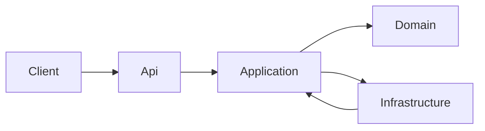
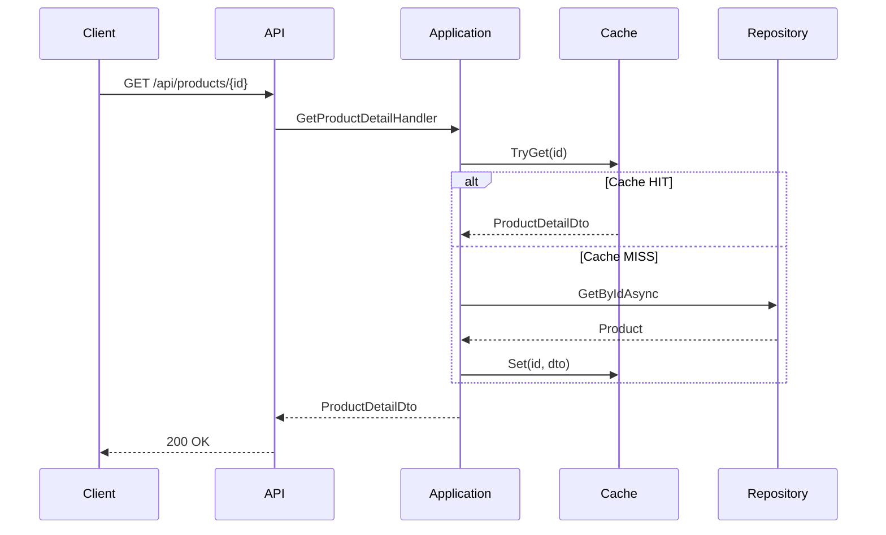
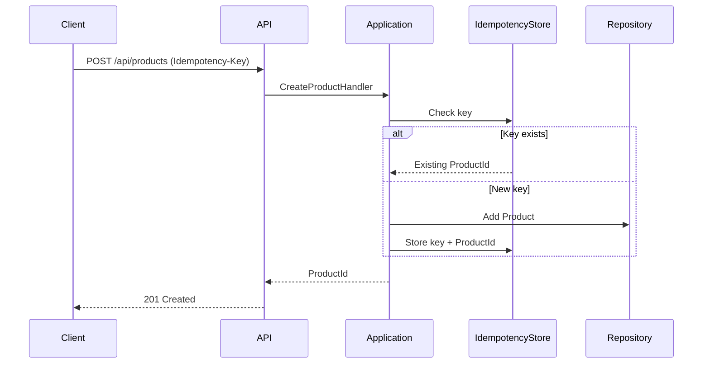
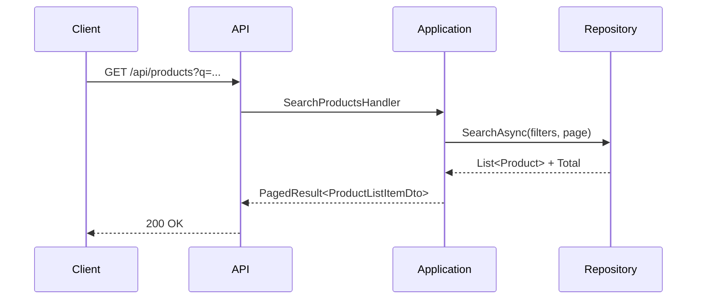
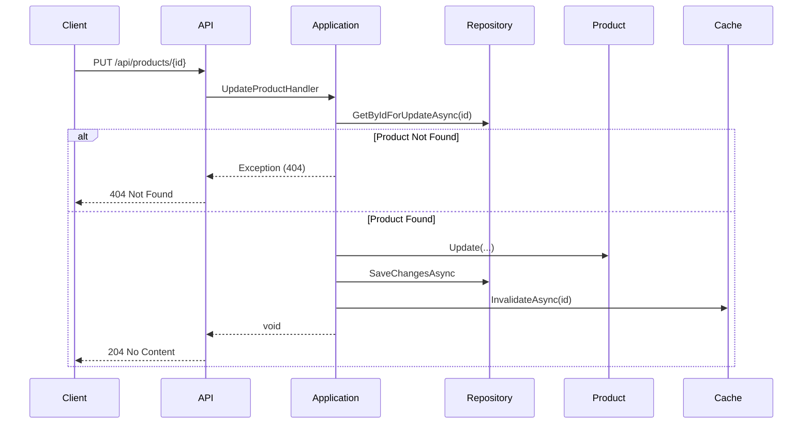
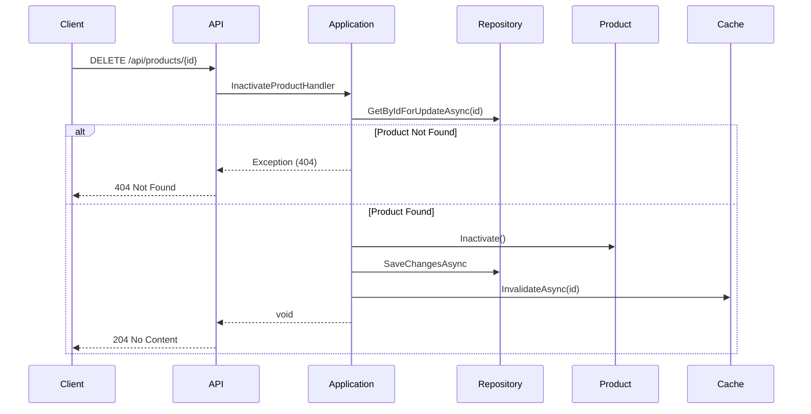

🇧🇷 Leia esta documentação em Português: [README.md](README.md)

# Products API

## Overview
**Products API** is a RESTful backend application developed in **.NET 8 (ASP.NET Core)** focused on product management. The project was built as a technical challenge, simulating part of a marketplace operation (inspired by Mercado Livre). It demonstrates the application of software engineering best practices, clean architecture, and modern design patterns in a realistic scenario.

**Main Stack:**
- .NET 8 (C#)
- Entity Framework Core (InMemory Database)
- Docker
- xUnit (Unit and Integration Tests)

## Key Features
- **Product Detail**: Optimized GET endpoint returning complete product information (price, stock, pictures, etc.).
- **Listing and Search**: GET endpoint supporting pagination, text search (`q`), and filtering by brand and condition (new/used).
- **Idempotent Registration**: Secure POST endpoint requiring an `Idempotency-Key` header to prevent duplicate creations during network retries.
- **Update**: PUT endpoint for full modification of product data.
- **Logical Deletion**: DELETE endpoint performing Soft Delete (inactivating the product) instead of physical removal.
- **Read Cache**: `IMemoryCache` implementation for the detail endpoint, reducing database load.
- **Robust Validation**: Uses FluentValidation, returning `422 Unprocessable Entity` for business errors.
- **Error Handling**: Global middleware standardizing API error responses.

## Architectural View

The solution follows a layered architecture inspired by **Ports & Adapters (Hexagonal)** and **Clean Architecture**, promoting separation of concerns and enhancing testability.

- **Api**: Entry Point layer. Contains Controllers, DI setup, Middleware, and Swagger definitions.
- **Application**: The heart of business logic. Implements a lightweight **CQRS** (Command Query Responsibility Segregation) pattern, using *Handlers* for each use case (e.g., `CreateProductHandler`, `GetProductDetailHandler`). Defines interfaces (Ports) for infrastructure.
- **Domain**: The core of the system. Contains Entities, Value Objects, and Enums. Completely agnostic of external frameworks.
- **Infrastructure**: Implements interfaces defined by Application (Adapters). Contains `DbContext` (EF Core), Repositories, Cache implementations, and database configurations.

### Technical Decisions
- **Lightweight CQRS**: Separating commands (write) and queries (read) allows optimizing each flow independently. Specific handlers keep code focused (SRP).
- **AutoMapper**: Used strictly to convert Domain Entities to Response DTOs in the Application layer, preventing domain logic leakage to the API.
- **EF Core InMemory**: Chosen to simplify execution and evaluation of the challenge without requiring an external database (SQL Server/Postgres), while keeping the structure ready for migration.
- **Cache**: "Look-aside" strategy implemented with `IMemoryCache` to demonstrate performance concern for High Read endpoints.
- **Idempotency**: Manually implemented with an `InMemoryIdempotencyStore` to ensure reliability of creation requests.

## Diagrams

### Layered Architecture


### GET Detail Flow (with Cache)


### POST Flow (with Idempotency)


### GET List Flow (Search and Pagination)


### PUT Flow (Update)


### DELETE Flow (Logical Deletion)


## Key Endpoints

Full documentation available via Swagger.

1.  **`GET /api/products/{id}`**: Retrieves product details. Uses cache.
2.  **`GET /api/products`**: Lists products with pagination. Parameters: `page`, `pageSize`, `q` (search), `brand`, `condition`.
3.  **`POST /api/products`**: Creates a new product. `Idempotency-Key` (UUID) header is MANDATORY. Validates business rules and format.
4.  **`PUT /api/products/{id}`**: Updates an existing product and invalidates its cache.
5.  **`DELETE /api/products/{id}`**: Performs logical deletion of the product and invalidates cache.

## Design Decisions and Principles
- **Clean Code**: Clear naming, small and focused methods.
- **SOLID**:
    - **S (SRP)**: Each Handler (e.g., `CreateProductHandler`) has a single responsibility.
    - **O (OCP)**: The architecture allows adding new use cases without modifying existing ones (e.g., new Handlers).
    - **L (LSP)**: Repository implementations (`ProductRepository`) replace interfaces (`IProductRepository`) without breaking expected behavior.
    - **I (ISP)**: Granular interfaces like `IProductRepository` define only the methods necessary for the context.
    - **D (DIP)**: The Application layer depends on abstractions (`IProductRepository`), and dependency injection resolves the concrete implementation at runtime.
- **Idempotency**: Guarantee that network retry requests do not generate duplicate data.
- **Soft Delete**: Business decision to maintain history and referential integrity by only marking the record as inactive.

## How to Run the Project

### Prerequisites
- .NET 8 SDK
- Docker (Optional, but recommended)

### Local Execution (Windows/Linux/macOS)
```bash
# Restore dependencies
dotnet restore

# Run API
dotnet run --project Products.Api
```
The API will be available at `http://localhost:5140` (or configured port).

### Docker Execution (Recommended)
To run the application in an isolated container with all configurations ready:

1.  **Build image**:
    ```bash
    docker build -t products-api .
    ```

2.  **Run container**:
    ```bash
    docker run --rm -p 8080:8080 products-api
    ```

3.  **Access Swagger**: Open `http://localhost:8080/swagger` in your browser.

### Via Docker Compose
```bash
docker-compose up --build
```

### Seed File
The project automatically loads an initial set of products defined in `products.json` file upon startup, facilitating manual testing.

## How to Run Tests

The project has two test suites:

1.  **Products.UnitTests**: Isolated tests for domain and application logic.
2.  **Products.IntegrationTests**: "Black-box" tests that spin up the API in memory and test endpoints via real HTTP.

To run all tests:
```bash
dotnet test
```

## Final Observations
This project was developed focusing on code quality and demonstrating robust architecture for .NET APIs. The directory structure and layer separation allow the project to easily scale to use real databases (SQL), distributed cache systems (Redis), and messaging without major refactoring in the application core.
