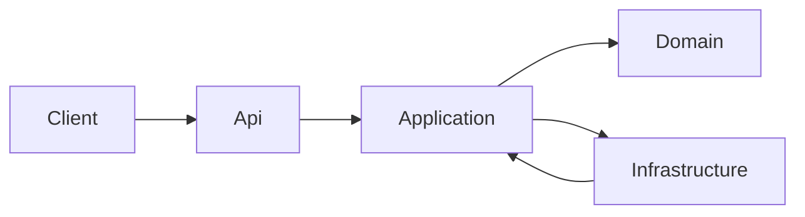
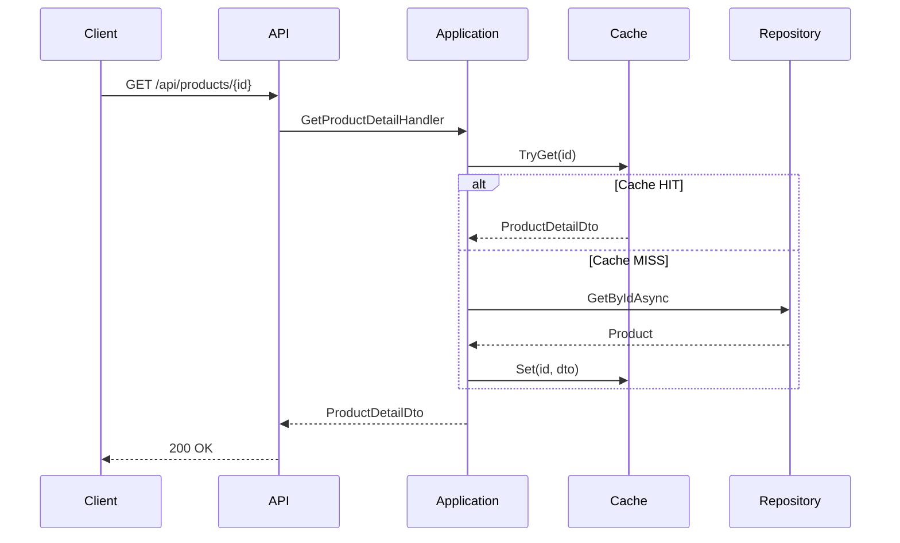
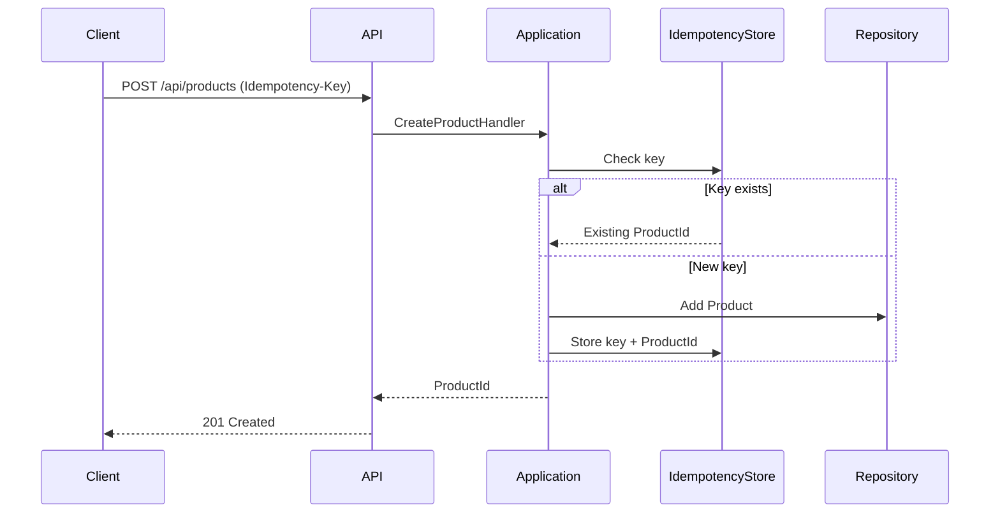
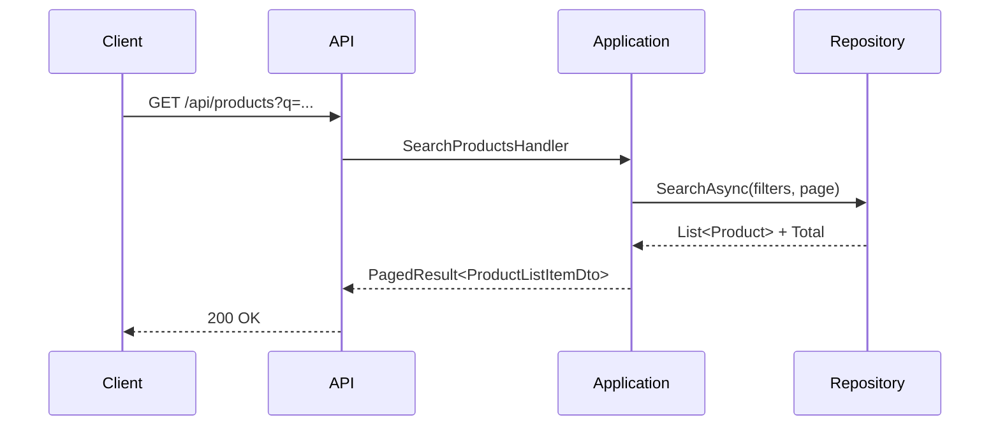
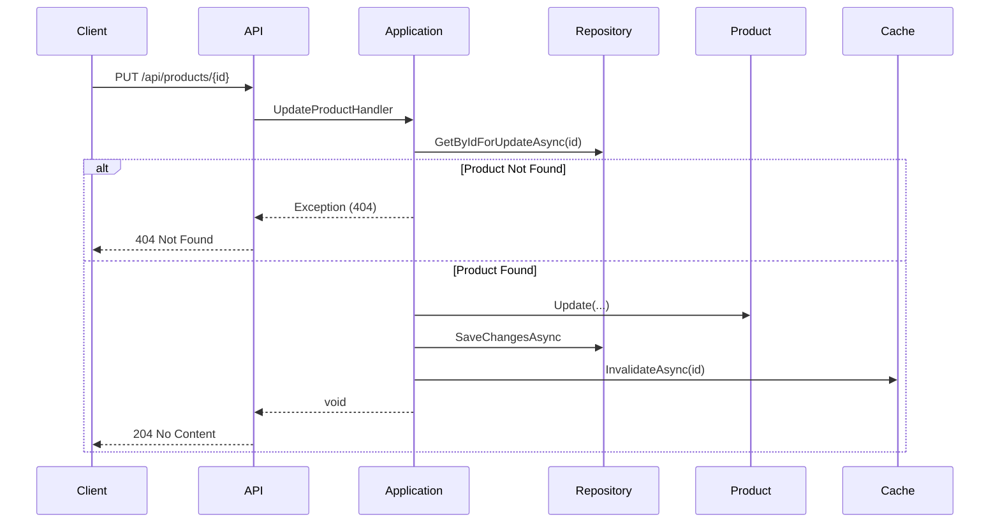
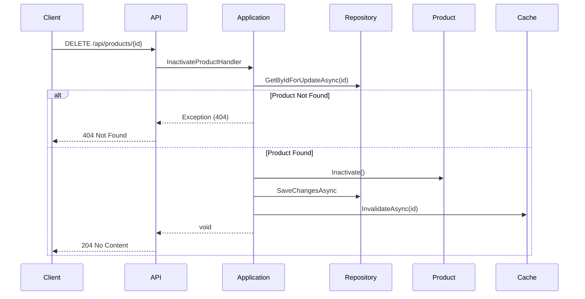

🇺🇸 Read this documentation in English: [README.en.md](README.en.md)

# Products API

## Visão Geral
A **Products API** é uma aplicação backend RESTful desenvolvida em **.NET 8 (ASP.NET Core)** focada no gerenciamento de produtos. O projeto foi construído como um desafio técnico, simulando uma parte da operação de um marketplace (inspirado no Mercado Livre). Ele demonstra a aplicação de boas práticas de engenharia de software, arquitetura limpa e padrões de design modernos em um cenário realista.

**Stack Principal:**
- .NET 8 (C#)
- Entity Framework Core (InMemory Database)
- Docker
- xUnit (Testes de Unidade e Integração)

## Funcionalidades Principais
- **Detalhe de Produto**: Endpoint GET otimizado, retornando informações completas do produto (preço, estoque, imagens, etc.).
- **Listagem e Busca**: Endpoint GET com suporte a paginação, busca textual (`q`), e filtros por marca e condição (novo/usado).
- **Cadastro Idempotente**: Endpoint POST seguro que exige um header `Idempotency-Key` para evitar duplicidade de criações em caso de retries de rede.
- **Atualização**: Endpoint PUT para modificação completa dos dados do produto.
- **Remoção Lógica**: Endpoint DELETE que inativa o produto (Soft Delete) em vez de apagá-lo fisicamente do banco.
- **Cache de Leitura**: Implementação de `IMemoryCache` para o endpoint de detalhes, reduzindo carga no banco de dados.
- **Validação Robusta**: Uso de validações fluentes (FluentValidation), retornando `422 Unprocessable Entity` para erros de negócio.
- **Tratamento de Erros**: Middleware global que padroniza as respostas de erro da API.

## Visão Arquitetural

A solução segue uma arquitetura em camadas inspirada em **Ports & Adapters (Hexagonal)**, promovendo a separação de responsabilidades e facilitando a testabilidade.

- **Api**: Camada de entrada (Entry Point). Contém Controllers, configuração de DI, Middleware e Definições Swagger.
- **Application**: Coração da lógica de negócio. Implementa o padrão **CQRS** (Command Query Responsibility Segregation) de forma leve, utilizando *Handlers* para cada caso de uso (ex: `CreateProductHandler`, `GetProductDetailHandler`). Define as interfaces (Portas) para a infraestrutura.
- **Domain**: Núcleo do sistema. Contém Entidades, Value Objects e Enums. É totalmente agnóstico de frameworks externos.
- **Infrastructure**: Implementa as interfaces definidas pela Application (Adaptadores). Contém o `DbContext` (EF Core), Repositórios, Implementações de Cache e configurações de banco de dados.

### Decisões Técnicas
- **CQRS Leve**: A separação entre comandos (escrita) e consultas (leitura) permite otimizar cada fluxo independentemente. Handlers específicos mantêm o código focado (SRP).
- **AutoMapper**: Utilizado estritamente para converter Entidades de Domínio para DTOs de resposta na camada de Aplicação, evitando vazamento de lógica de domínio para a API.
- **EF Core InMemory**: Escolhido para simplificar a execução e avaliação do desafio sem a necessidade de subir um banco de dados externo (SQL Server/Postgres), mas mantendo a estrutura pronta para essa migração.
- **Cache**: Estratégia "Look-aside" implementada com `IMemoryCache` para demonstrar preocupação com performance em endpoints de alta leitura (High Read).
- **Idempotência**: Implementada manualmente com um `InMemoryIdempotencyStore` para garantir a confiabilidade de requisições de criação.

## Diagramas

### Arquitetura em Camadas


### Fluxo GET Detail (com Cache)


### Fluxo POST (com Idempotência)


### Fluxo GET List (Busca e Paginação)


### Fluxo PUT (Atualização)


### Fluxo DELETE (Remoção Lógica)


## Endpoints Principais

A documentação completa pode ser visualizada via Swagger.

1.  **`GET /api/products/{id}`**: Obtém os detalhes de um produto. Utiliza cache.
2.  **`GET /api/products`**: Lista produtos com paginação. Parâmetros: `page`, `pageSize`, `q` (busca), `brand`, `condition`.
3.  **`POST /api/products`**: Cria um novo produto. OBRIGATÓRIO informar o header `Idempotency-Key` (UUID). Valida regras de negócio e formato.
4.  **`PUT /api/products/{id}`**: Atualiza dados de um produto existente e invalida o cache correspondente.
5.  **`DELETE /api/products/{id}`**: Realiza a remoção lógica do produto e invalida o cache.

## Decisões de Design e Princípios
- **Clean Code**: Nomenclatura clara, métodos pequenos e focados.
- **SOLID**:
    - **S (SRP)**: Cada Handler (ex: `CreateProductHandler`) tem uma única responsabilidade.
    - **O (OCP)**: A arquitetura permite adicionar novos casos de uso sem alterar os existentes (ex: novos Handlers).
    - **L (LSP)**: Implementações de repositório (`ProductRepository`) substituem interfaces (`IProductRepository`) sem quebrar o comportamento esperado.
    - **I (ISP)**: Interfaces granulares como `IProductRepository` definem apenas os métodos necessários para o contexto.
    - **D (DIP)**: A camada de Aplicação depende de abstrações (`IProductRepository`), e a injeção de dependência resolve a implementação concreta em tempo de execução.
- **Idempotência**: Garantia de que retry de requisições de rede não gerem dados duplicados.
- **Soft Delete**: Decisão de negócio para manter histórico e integridade referencial, apenas marcando o registro como inativo.

## Como Executar o Projeto

### Pré-requisitos
- .NET 8 SDK
- Docker (Opcional, mas recomendado)

### Execução Local (Windows/Linux/macOS)
```bash
# Restaurar dependências
dotnet restore

# Executar a API
dotnet run --project Products.Api
```
A API estará disponível em `http://localhost:5140` (ou porta configurada).

### Execução via Docker (Recomendado)
Para rodar a aplicação em um container isolado com todas as configurações prontas:

1.  **Build da imagem**:
    ```bash
    docker build -t products-api .
    ```

2.  **Rodar o container**:
    ```bash
    docker run --rm -p 8080:8080 products-api
    ```

3.  **Acessar Swagger**: Abra `http://localhost:8080/swagger` no navegador.

### Via Docker Compose
```bash
docker-compose up --build
```

### Arquivo Seed
O projeto carrega automaticamente um conjunto inicial de produtos definidos no arquivo `products.json` ao iniciar, facilitando os testes manuais.

## Como Rodar os Testes

O projeto possui duas suítes de testes:

1.  **Products.UnitTests**: Testes isolados da lógica de domínio e aplicação.
2.  **Products.IntegrationTests**: Testes "black-box" que sobem a API em memória e testam os endpoints via HTTP real.

Para rodar todos os testes:
```bash
dotnet test
```

## Observações Finais
Este projeto foi desenvolvido com foco em qualidade de código e demonstração de arquitetura robusta para APIs .NET. A estrutura de diretórios e a separação de camadas permitem que o projeto escale facilmente para utilizar bancos de dados reais (SQL), sistemas de cache distribuído (Redis) e mensageria sem grandes refatorações no núcleo da aplicação.